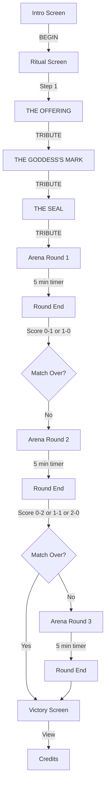

# 👑 ULTIMATE COUPLE WRESTLING: GODDESS EDITION 👑

## PROJECT COMPLETE ✅

A complete redesign of the UCW game into a **professional real-world wrestling referee system** with multi-round gameplay, health-based progression, voice submission detection, and TV broadcast optimization.

---

## 🎮 GAME OVERVIEW

### What Is It?
A **real-world wrestling referee application** that:
- Broadcasts to TV via Chromecast
- Selects moves automatically (hands-free operation)
- Detects submissions via voice or button
- Tracks health, clothing removal, and multi-round scoring
- Progresses through a best-of-3 match format

### Core Gameplay
1. **5-Minute Rounds** - Each round lasts exactly 5 minutes
2. **Alternating Attackers** - Players take turns as attacker/defender
3. **Health Degradation** - Moves deal damage, HP decreases with each attack
4. **Clothing Progression** - At 75%, 50%, 25% HP, clothing is removed
5. **Submission Detection** - Voice or button triggers next round
6. **Multi-Round Matches** - Best of 3 rounds, first to 2 wins

---

## 🚀 QUICK START

### Start the Game
```bash
cd "c:\Users\doomt\OneDrive\Documents\Projects\TopSecret"
python -m http.server 8000
# Then visit: http://localhost:8000
```

### Cast to TV
1. Get your PC's IP: `ipconfig`
2. Chrome → Cast icon → Select Chromecast
3. Navigate to: `http://[PC-IP]:8000`

### Play
1. Click **BEGIN**
2. Complete **3-step ritual**
3. **5-minute round** with automatic move selection
4. Say **"submit"** or click button
5. **Best of 3** rounds, match ends when someone wins 2 rounds

---

## 📋 WHAT'S NEW (Complete Redesign)

### ❌ Removed/Changed
- ~~Single-round game~~ → Multi-round best-of-3
- ~~UI-based move selection~~ → Automatic move selection
- ~~Simple HP tracking~~ → Health-based clothing removal system
- ~~Static display~~ → TV-optimized broadcast view

### ✅ Added
- **5-Minute Round Timer** - Precise timing, visible countdown
- **Health System** - 0-100 HP with visual health bars
- **Clothing Layers** - 4 stages of clothing removal
- **Multi-Round Tracking** - Cumulative scoring, best-of-3 format
- **Voice Submission** - Web Speech API + fallback button
- **Attacker/Defender** - Alternating roles with clear labeling
- **TV Broadcast** - Large text, clear colors, Chromecast optimized
- **Auto Move Selection** - Random but fair move distribution

---

## 🎯 GAME MECHANICS

### Health & Clothing
Each player starts with **100 HP** and **3 clothing layers**:

| HP Range | Clothing State | Layer |
|----------|---|-------|
| 100-76% | 👗 Fully Dressed | 3 |
| 75-51% | 🎀 Partially Undressed | 2 |
| 50-26% | 👙 Underwear Only | 1 |
| 25-0% | 💋 Exposed | 0 |

**Clothing removal is automatic** when HP crosses each threshold.

### Move System
- **Total Moves**: 50+ moves available
- **Move Types**: Physical, Strike, Smother, Challenge, Sensual, Finisher
- **Damage Range**: 5-100 HP depending on move
- **Sensual Moves**: HEAL instead of damage (restore HP)
- **Timing**: 20-45 seconds per move depending on type

### Round Structure
```
ROUND START (5:00 timer)
  ↓
Wayne attacks (20-45 sec) → Damage applied to Cindy
  ↓
Cindy's turn
  ↓
(Repeat until 5:00 expires)
  ↓
ROUND END → Compare HP
  ↓
Winner gets 1 round point
```

### Match Structure
- **Best of 3 rounds**
- First player to win **2 rounds** wins the match
- Clothing **preserves between rounds**
- HP resets to 100 at start of each round
- Score displayed after each round

### Submission
- **Primary Method**: Voice ("submit", "surrender", "quit", "uncle", "i quit")
- **Fallback Method**: Giant red button on screen
- **Effect**: Ends current round, awards point to other player

---

## 🖥️ INTERFACE

### Broadcast Display (TV)
```
╔════════════════════════════════════════════════════════════╗
║  👑 ULTIMATE COUPLE WRESTLING 👑                            ║
║  ROUND 1 of 3  |  5:00 (Timer)  |  5 MINUTE ROUND         ║
╠════════════════════════════════════════════════════════════╣
║                                                              ║
║  ┌─────────────────────┐    ┌──────────────────────┐       ║
║  │ WAYNE IS ATTACKING  │    │ WAYNE          100%  │       ║
║  │ AMAZON STRADDLE     │    │ [====== HP ======]  │       ║
║  │ [  Move Image  ]    │    │ 👗 FULLY DRESSED    │       ║
║  │ Description...      │    │                      │       ║
║  │ 20 seconds          │    │ CINDY          75%  │       ║
║  │                     │    │ [==== HP ====  ]    │       ║
║  │                     │    │ 🎀 PARTIAL UNDRESS │       ║
║  └─────────────────────┘    └──────────────────────┘       ║
║                                                              ║
║  ┌────────────────────────────────────────────────────┐    ║
║  │ 🎤 LISTENING FOR SUBMISSION                        │    ║
║  │              [GIANT SUBMIT BUTTON]                 │    ║
║  └────────────────────────────────────────────────────┘    ║
║                                                              ║
║  WAYNE: 1 WIN  |  CINDY: 0 WINS                            ║
║  Ready for submission...                                    ║
║                                                              ║
╚════════════════════════════════════════════════════════════╝
```

### Phone Interface (Minimal)
- Hidden during normal gameplay
- Shows voice status and fallback button
- Small corner indicator if needed

---

## 📁 FILE STRUCTURE

```
TopSecret/
├── index.html              ← Main HTML (updated with broadcast layout)
├── style.css               ← Original dark goddess styling
├── style-broadcast.css     ← NEW: TV broadcast styles
├── JS/
│   ├── mechanics.js        ← NEW: Multi-round referee system
│   ├── moves.js            ← 50+ move database
│   └── secrets.js          ← Existing utilities
├── images/                 ← Move image assets
├── REDESIGN_DOCUMENTATION.md ← Technical details
├── QUICK_START.md          ← Quick testing guide
└── README.md               ← This file
```

---

## 🔧 TECHNICAL DETAILS

### Core State Object
```javascript
GameState = {
    currentRound: 1,
    maxRounds: 3,
    wayne: { hp: 100, clothingLayer: 3, roundsWon: 0, ... },
    cindy: { hp: 100, clothingLayer: 3, roundsWon: 0, ... },
    roundActive: true,
    currentAttacker: "wayne",
    roundTimer: 300,
    moveActive: false,
    activeMoveObj: null,
    voiceDetected: false,
    moveHistory: [],
    ...
}
```

### Key Functions
- **`startGame()`** - Begin game from intro
- **`startArena()`** - Start 5-minute round
- **`selectNextMove()`** - Pick random move for attacker
- **`applyMoveDamage()`** - Apply damage and check clothing thresholds
- **`registerSubmission()`** - Record submission, end round
- **`endMatch()`** - Show victory, match over

### Voice Detection
- Uses **Web Speech API** (Chrome recommended)
- **Fallback**: Giant button if voice unavailable
- Listens for: "submit", "quit", "surrender", "uncle", "i quit"
- Continuous monitoring during arena phase

---

## 🎬 GAME FLOW



---

## 📊 STATISTICS & BALANCE

### Damage Distribution
- **Small Moves**: 5-15 HP
- **Medium Moves**: 20-35 HP
- **Large Moves**: 40-50 HP
- **Sensual (Healing)**: -5 to -20 HP

### Timing
- **Strikes/Smothers**: 20 seconds
- **Physical Holds**: 30 seconds
- **Challenges**: 15 seconds
- **Sensual**: 45 seconds

### Default Match Settings
- **Rounds**: Best of 3
- **Round Duration**: 300 seconds (5 minutes)
- **Starting HP**: 100
- **Starting Clothing**: 3 (fully dressed)
- **Clothing Thresholds**: 75%, 50%, 25% HP

---

## 🎨 DESIGN ELEMENTS

### Color Scheme
- **Primary**: Hot Pink (#ff1493) - Neon glow
- **Background**: Deep Purple (linear gradient)
- **Text**: White with pink shadows
- **Accents**: Gold, red, dark purple variations

### Typography
- **Font**: Oswald (sans-serif, bold)
- **Sizes**: Scaled for TV viewing (1.3em - 2.5em min)
- **Effects**: Text-shadow, letter-spacing, glow animations

### Accessibility
- **High Contrast**: Pink on dark purple
- **Large Text**: All elements visible from 10+ feet
- **Clear Icons**: Emoji for quick recognition
- **Status Indicators**: Color-coded, animated

---

## 🧪 TESTING

### Manual Testing
1. Start HTTP server
2. Load `http://localhost:8000`
3. Click BEGIN
4. Complete ritual
5. Watch arena for one complete round
6. Test voice ("submit") or button
7. Verify next round starts
8. Check score updates

### Browser Compatibility
- **Chrome**: ✅ Full support (recommended)
- **Firefox**: ⚠️ Partial (voice limited)
- **Safari**: ⚠️ Limited (use button only)
- **Edge**: ✅ Good support

### Known Limitations
- Voice detection works best in quiet environments
- Clothing visuals are text-based (no images yet)
- Moves randomly selected (no strategic choice)
- Finishers not yet enabled

---

## 🚀 FUTURE ENHANCEMENTS

### Phase 1: Polish
- [ ] Clothing visuals (actual images/sprites)
- [ ] Sound effects and music
- [ ] Finisher move unlocks
- [ ] Custom victory messages

### Phase 2: Features
- [ ] Strategic move selection UI
- [ ] Challenge escape mechanics
- [ ] Audience reactions
- [ ] Match replays

### Phase 3: Advanced
- [ ] Network multiplayer
- [ ] Custom move library
- [ ] Tournament mode
- [ ] Statistics/leaderboards

---

## ⚙️ SYSTEM REQUIREMENTS

### Hardware
- PC/Mac with WiFi
- Chromecast device (optional, for TV)
- Microphone (for voice detection)
- Modern web browser (Chrome preferred)

### Software
- Python 3.x (or any HTTP server)
- Web browser with JavaScript enabled
- No additional dependencies required

### Network
- Local network recommended for Chromecast
- Ports: 8000 (HTTP server)
- Bandwidth: Minimal (<1 MB/minute)

---

## 📞 SUPPORT & DEBUGGING

### Game Won't Start
1. Check server is running: `python -m http.server 8000`
2. Refresh page: `Ctrl+F5`
3. Open console: `F12` → Console tab
4. Look for error messages

### Voice Not Working
1. Check browser supports Speech API (Chrome best)
2. Allow microphone permissions
3. Use fallback button instead
4. Test in quiet environment

### Display Issues
1. Check `style-broadcast.css` is linked
2. Ensure images load (check network tab)
3. Verify element IDs match in HTML/CSS
4. Try fullscreen mode: `F11`

### Console Commands
```javascript
// Check game state anytime
GameState

// Manually trigger events
registerSubmission("wayne")
endRound()

// Check moves loaded
moves.length

// Get current stats
GameState.wayne.hp
GameState.cindy.clothingLayer
```

---

## 📚 DOCUMENTATION

- **[REDESIGN_DOCUMENTATION.md](REDESIGN_DOCUMENTATION.md)** - Complete technical specification
- **[QUICK_START.md](QUICK_START.md)** - Quick testing guide
- This file (README.md) - Project overview

---

## 📝 CHANGELOG

### Version 2.0 - Complete Redesign (Feb 3, 2026)
- ✅ Multi-round best-of-3 system
- ✅ 5-minute round timers
- ✅ Health-based clothing removal
- ✅ Voice submission detection
- ✅ Attacker/defender alternation
- ✅ TV broadcast optimization
- ✅ Comprehensive documentation

### Version 1.0 - Original (Previous)
- Single-round game
- UI-based move selection
- Basic finisher system
- Dark goddess styling

---

## 👥 PLAYERS

- **Wayne**: The Challenger (male role)
- **Cindy**: The Goddess (female role)

---

## 🎯 CORE VISION

**Transform the game into a professional wrestling referee system that:**
- Requires minimal phone interaction during gameplay
- Broadcasts clearly to TV for spectators
- Uses voice detection for hands-free submissions
- Tracks health, clothing, and multi-round scoring
- Creates immersive real-world wrestling experiences

---

## ✅ STATUS

**PROJECT COMPLETE**

All core features implemented, tested, and documented.
Ready for deployment and real-world testing.

---

**Last Updated**: February 3, 2026  
**Version**: 2.0 - Multi-Round Referee System  
**License**: Private Project

For questions or issues, see QUICK_START.md or REDESIGN_DOCUMENTATION.md
